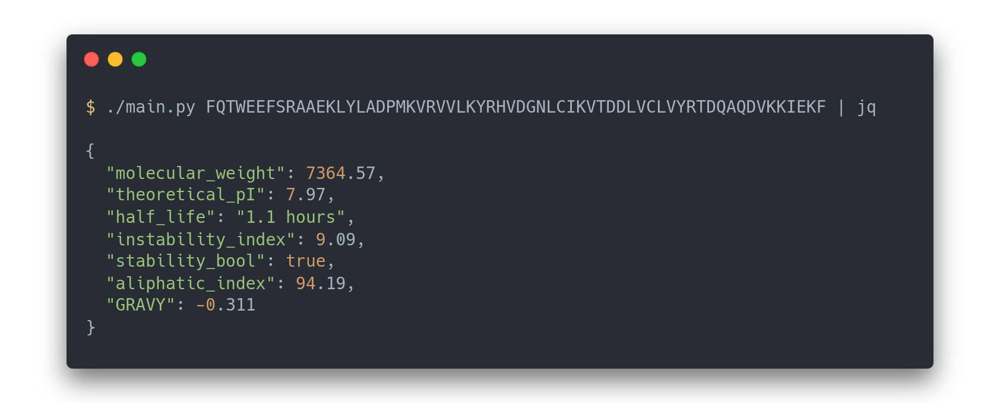

# EasyProtParam

A lightweight zero-dependency Python3 wrapper for [the Expasy ProtParam web server](https://web.expasy.org/protparam/). Best paired with [jq](https://github.com/jqlang/jq).

<center>
    
</center>

## Requirements
- Python 3.6+

## Usage
```
./main.py <protein sequence>
```